# Spring Boot + JSP + Apache Tiles + Maven

---

### 프로젝트 기본 구성

- Adoptium: jdk-8.0.312.7-hotspot
- Spring Boot Starter: 2.6.1
- JSTL: 1.2
- Tiles JSP Support: 3.0.8
- Logback Project: 1.2.9
- Log4Jdbc Log4j2 JDBC 4 1: 1.16

---

## 1. 프로젝트 생성

- Spring Boot 프로젝트를 생성하는 3가지 방법이 존재합니다.

  - Visual Studio Code에서 Spring Initializr를 이용한 프로젝트 생성
  - 공식사이트에서 프로젝트 생성
  - 기존 템플레이트 재사용

- Visual Studio Code, 공식사이트에서 프로젝트 생성했다면 아래의 기본 폴더를 추가합니다.
  - [main > webapp > resources]
  - [main > webapp > WEB-INF > views]

### 1.1 Visual Studio Code에서 Spring Initializr를 이용한 프로젝트 생성

- [Ctrl + Shift + P] > Spring Initializr: Create a Maven Project 로 기본 프로젝트 생성합니다.

  <details><summary>보기</summary>

  - Spring initrializr: create a Maven Project 실행

  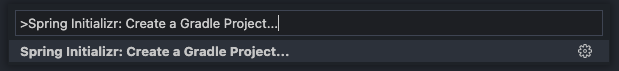

  - Spring boot version 설정

  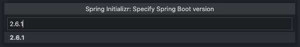

  - 언어 설정

  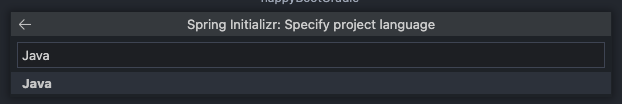

  - groupId 설정

  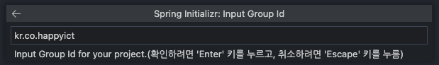

  - artifactId 설정

  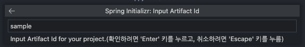

  - packaging type 설정

  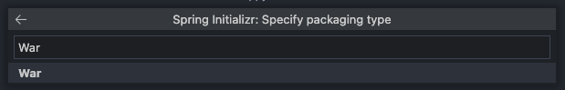

  - Java version 설정

  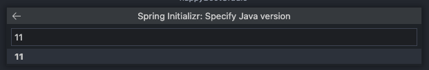

  - 의존성 설정.

  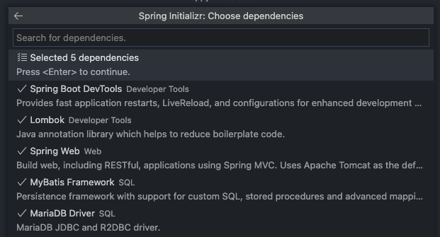

  - 프로젝트를 생성할 폴더를 설정

  

  - Open

  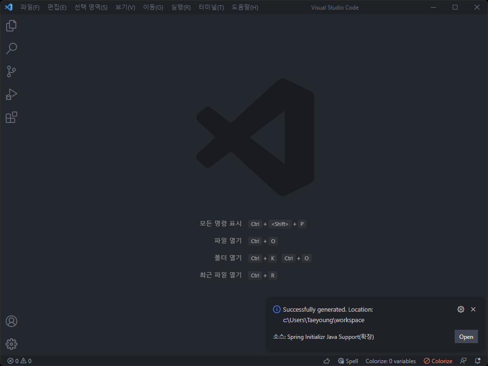

  - 생성된 프로젝트 구조

  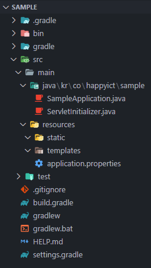

  </details>

### 1.2 [공식사이트](https://start.spring.io/)에서 프로젝트 생성

- 공식사이트에서 spring initializr를 이용하여 프로젝트 생성합니다.

  - Project, Language, Spring Boot, Project Metadata, Dependencies 설정 후 GENERATE 클릭합니다.

  - 이 문서는 JSP를 사용하기 때문에 [Project Metadata > Packaging]에서 Jar 선택 시 배포에 문제가 발생 할 수 있습니다.

  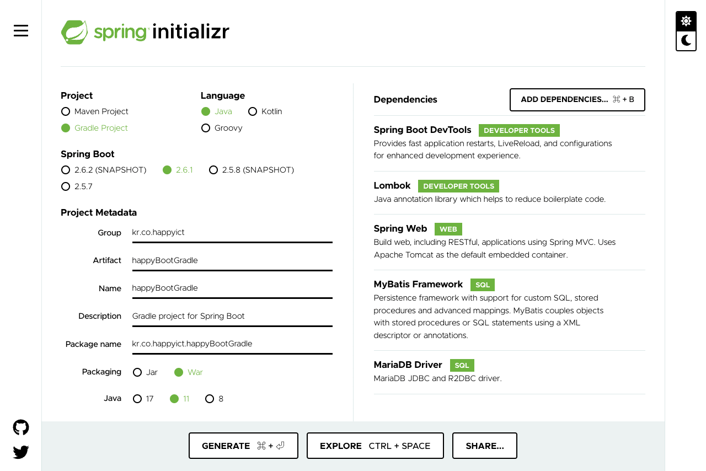

### 1.3 기존 템플레이트 재사용

- [template > happyBootGradle]를 사용합니다. [3. 프로젝트 실행](#3-프로젝트-실행)으로 넘어갑니다.

---

## 2. 설정

### 2.1 build.gradle 수정

- [Logback Classic Module](https://mvnrepository.com/artifact/ch.qos.logback/logback-classic/1.2.9)
- [JSTL](https://mvnrepository.com/artifact/javax.servlet/jstl/1.2)
- [Tomcat Embed Jasper](https://mvnrepository.com/artifact/org.apache.tomcat.embed/tomcat-embed-jasper/9.0.56)
- [Tiles JSP Support](https://mvnrepository.com/artifact/org.apache.tiles/tiles-jsp/3.0.8)
- [Log4Jdbc Log4j2 JDBC 4 1](https://mvnrepository.com/artifact/org.bgee.log4jdbc-log4j2/log4jdbc-log4j2-jdbc4.1/1.16)

- build.gradle

    <details><summary>보기</summary>

  ```gradle
    dependencies {
      implementation 'org.springframework.boot:spring-boot-starter-web'
      implementation 'org.mybatis.spring.boot:mybatis-spring-boot-starter:2.2.0'
      compileOnly 'org.projectlombok:lombok'
      developmentOnly 'org.springframework.boot:spring-boot-devtools'
      runtimeOnly 'org.mariadb.jdbc:mariadb-java-client'
      annotationProcessor 'org.projectlombok:lombok'
      providedRuntime 'org.springframework.boot:spring-boot-starter-tomcat'
      testImplementation 'org.springframework.boot:spring-boot-starter-test'

      implementation 'ch.qos.logback:logback-classic:1.2.9'
      implementation 'javax.servlet:jstl'
      implementation 'org.apache.tomcat.embed:tomcat-embed-jasper'
      implementation 'org.apache.tiles:tiles-jsp:3.0.8'
      implementation 'org.bgee.log4jdbc-log4j2:log4jdbc-log4j2-jdbc4.1:1.16'
  }
  ```

    </details>

### 2.2 application.properties 설정

- /resources/application.properties

  <details><summary>보기</summary>

  - JDBC 설정

  ```properties
    spring.datasource.driver-class-name=net.sf.log4jdbc.sql.jdbcapi.DriverSpy
    spring.datasource.url=jdbc:log4jdbc:mariadb://localhost:3306/employees
    spring.datasource.username=scott
    spring.datasource.password=tiger
  ```

  - Spring Boot MVC 설정

  ```properties
  spring.mvc.view.prefix=/WEB-INF/views/
  spring.mvc.view.suffix=.jsp
  ```

  - MyBatis 설정

  ```properties
  mybatis.configuration.map-underscore-to-camel-case=true
  mybatis.type-aliases-package=kr.co.happyict.bootJSPMaven.domain
  mybatis.mapper-locations=mapper/*.xml
  ```

  - UTF-8 Encoding 설정

  ```properties
  server.servlet.encoding.charset=UTF-8
  server.servlet.encoding.enabled=true
  server.servlet.encoding.force=true
  ```

  - Log 설정

  ```properties
  logging.level.jdbc=off
  logging.level.jdbc.sqlonly=info
  logging.level.jdbc.sqltiming=off
  logging.level.jdbc.resultsettable=info
  logging.level.jdbc.audit=off
  logging.level.jdbc.resultset=off
  logging.level.jdbc.connection=off
  ```

  </details>

### 2.3 log4jdbc.log4j2.properties 추가

- /resources/log4jdbc.log4j2.properties
  <details><summary>보기</summary>

  ```properties
  log4jdbc.drivers=org.mariadb.jdbc.Driver
  log4jdbc.spylogdelegator.name=net.sf.log4jdbc.log.slf4j.Slf4jSpyLogDelegator
  log4jdbc.dump.sql.maxlinelength=0
  ```

  </details>

### 2.4 TilesConfig 추가

- /java/.../config/TilesConfig.java

  <details><summary>보기</summary>

  ```java
  package kr.co.happyict.bootJSPMaven.config;

  import org.springframework.context.annotation.Bean;
  import org.springframework.context.annotation.Configuration;
  import org.springframework.web.servlet.view.UrlBasedViewResolver;
  import org.springframework.web.servlet.view.tiles3.TilesConfigurer;
  import org.springframework.web.servlet.view.tiles3.TilesView;

  @Configuration
  public class TilesConfig {

    @Bean
    public UrlBasedViewResolver tilesViewResolver() {
      UrlBasedViewResolver tilesViewResolver = new UrlBasedViewResolver();

      tilesViewResolver.setViewClass(TilesView.class);

      return tilesViewResolver;
    }

    @Bean
    public TilesConfigurer tilesConfigurer() {
      TilesConfigurer tilesConfigurer = new TilesConfigurer();

      tilesConfigurer.setDefinitions("/WEB-INF/tiles.xml");

      return tilesConfigurer;
    }

  }
  ```

  </details>

### 2.5 tiles.xml 추가

- /WEB-INF/tiles.xml

  <details><summary>보기</summary>

  ```xml
  <?xml version="1.0" encoding="utf-8"?>
  <!DOCTYPE tiles-definitions PUBLIC "-//Apache Software Foundation//DTD Tiles Configuration 3.0//EN"
    "http://tiles.apache.org/dtds/tiles-config_3_0.dtd">
  <!-- Definitions for Tiles documentation -->
  <tiles-definitions>
    <definition name="base" template="/WEB-INF/views/common/layout.jsp">
    <put-attribute name="header" value="/WEB-INF/views/common/header.jsp"/>
      <put-attribute name="body" value=""/>
      <put-attribute name="footer" value="/WEB-INF/views/common/footer.jsp"/>
    </definition>

    <definition name="*" extends="base">
      <put-attribute name="body" value="/WEB-INF/views/{1}.jsp"/>
    </definition>
  </tiles-definitions>
  ```

  </details>

---

## 3. 프로젝트 실행

- SPRING BOOT DASHBOARD에서 실행 버튼 클릭합니다.

  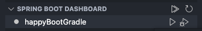

  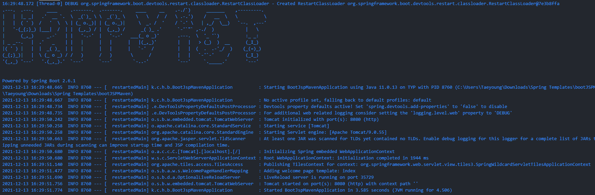

- banner.txt 을 통해 banner의 텍스트를 바꿀 수 있습니다.

- /resources/banner.txt

  ```text
                      ·-----
                    ·-/++++ \
  ·------          · \     \/
  ·   \+++\---     · \    ·  \\
  |  ·        \-- · \   ·- \- \
  \ |           \/\  ·-      |
    \/\  ·------   \\        ·     ·----  ·- ·-    ·-      ·-     ·--      ·------  ·----------
    \+  |        ·  \-  ·-- |      ·/+   |+  \    |+      |+     | \    ·-/+           \ \
      \\- \         · \\-   \/     ·/  \- |+ ·/    |+\-----/+     | |   · \             | |
        \\ \     ·    | \   |      |+  |+ |+ |+   ·/+++++++++\    | |  · \              | |
          \/\   ·/\---   \ ·        \--/ /+\           ||         | |  | |              | |
            \\-  \+   \- |\            ·-    \-   ++++++++++++    | |   \ \             | |
              \-/ \    \/             |+    |+            |+     |\/    \/\------      |\/
                    \---                 \--                \     |          \+++       |

  ${application.title} ${application.version}
  Powered by Spring Boot ${spring-boot.version}
  ```

- 상단의 DASHBOARD로 조작이 가능합니다.

  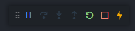

---

## 4. 웹 브라우저로 결과 확인

- 지구모양 아이콘 클릭 혹은 직접 브라우저에서 확인합니다.

  

  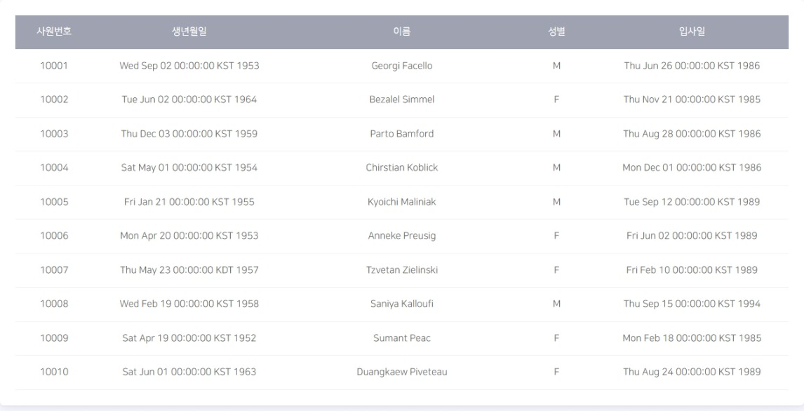

  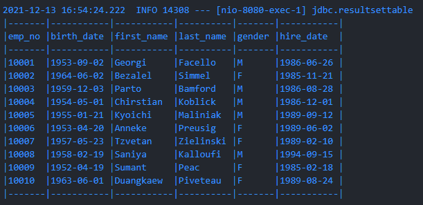
