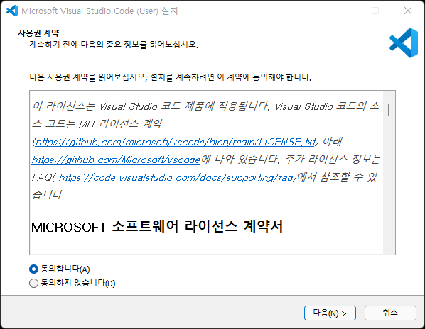
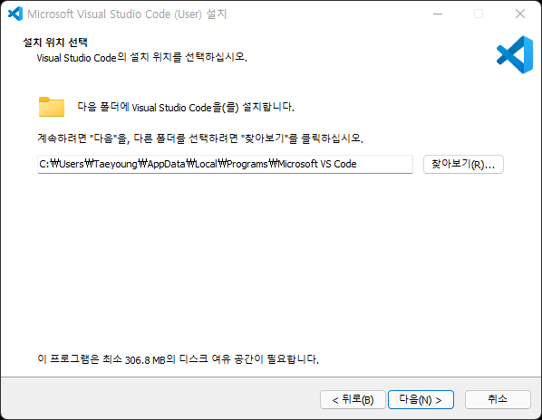
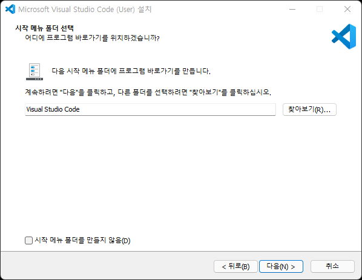
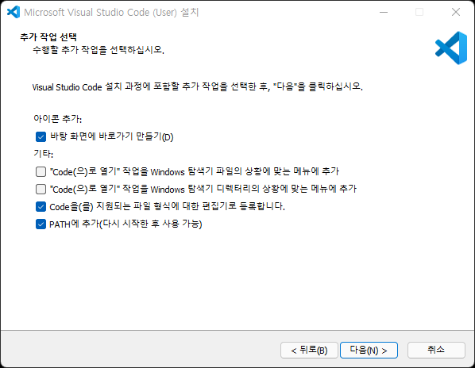
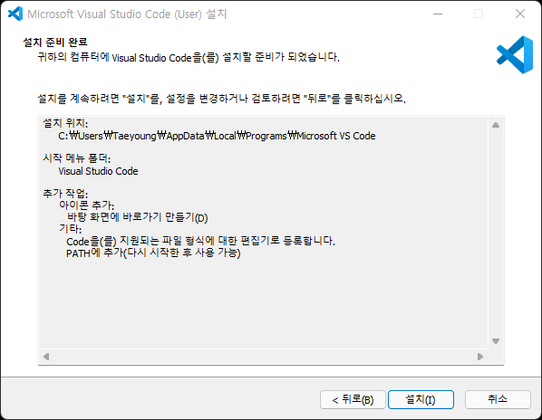
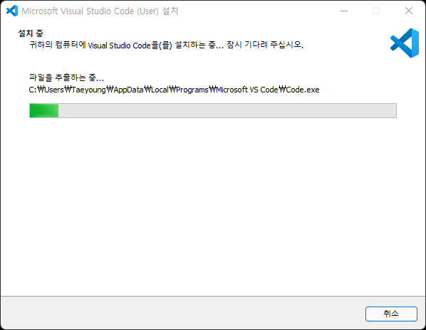
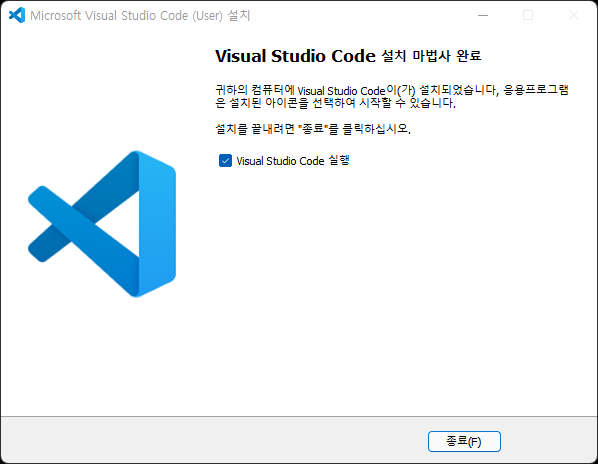
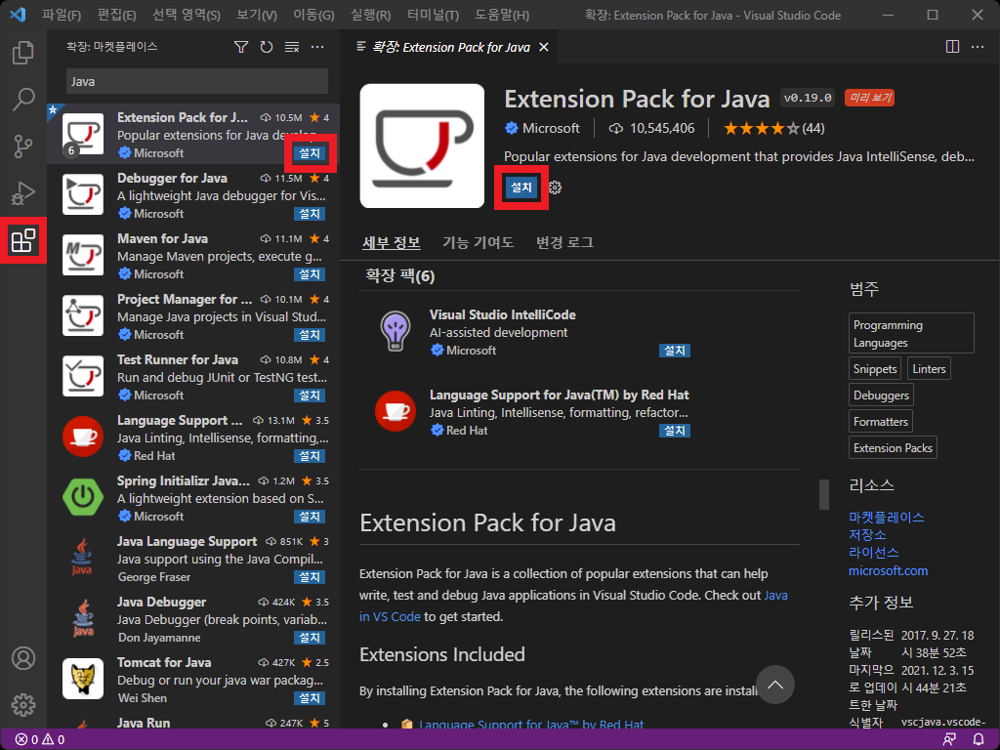

# Visual Studio Code 설치

---

## 1. Visual Studio Code 설치 및 확장팩 설치

### 1.1 Visual Studio Code 다운로드

- https://code.visualstudio.com 에 접속하여 설치파일을 다운로드 합니다.

- [VSCodeUserSetup-x64-1.63.0.exe](https://az764295.vo.msecnd.net/stable/7db1a2b88f7557e0a43fec75b6ba7e50b3e9f77e/VSCodeUserSetup-x64-1.63.0.exe) [작성일 기준 최신버전]

  

### 1.2 Visual Studio Code 설치

설치 과정
 

### 1.3. 확장팩 설치

- 화면 좌측 확장 아이콘 클릭 혹은 단축키 [Ctrl + Shift + X] 입력 후 원하는 확장팩을 검색 한 뒤 설치 버튼을 클릭합니다.

  

---

## 2. 개발환경 별 확장팩 정리

### 2.1 공통

- [Extension Pack for Java](https://marketplace.visualstudio.com/items?itemName=vscjava.vscode-java-pack)

  - Java 확장팩 모음. 이하 6개 항목들이 설치됩니다.

  - [Language Support for Java™ by Red Hat](https://marketplace.visualstudio.com/items?itemName=redhat.java)

    - Supports code from Java 1.5 to Java 17
    - Latest Java 11 is the current minimum requirement

  - [Debugger for Java](https://marketplace.visualstudio.com/items?itemName=vscjava.vscode-java-debug)
  - [Test Runner for Java](https://marketplace.visualstudio.com/items?itemName=vscjava.vscode-java-test)
  - [Maven for Java](https://marketplace.visualstudio.com/items?itemName=vscjava.vscode-maven)
  - [Project Manager for Java](https://marketplace.visualstudio.com/items?itemName=vscjava.vscode-java-dependency)
  - [Visual Studio IntelliCode](https://marketplace.visualstudio.com/items?itemName=VisualStudioExptTeam.vscodeintellicode)

- [SVN](https://marketplace.visualstudio.com/items?itemName=johnstoncode.svn-scm)

- [Lombok Annotations Support for VS Code](https://marketplace.visualstudio.com/items?itemName=GabrielBB.vscode-lombok)

- [XML](https://marketplace.visualstudio.com/items?itemName=redhat.vscode-xml)

- [ESLint](https://marketplace.visualstudio.com/items?itemName=dbaeumer.vscode-eslint)

- [JavaScript (ES6) code snippets](https://marketplace.visualstudio.com/items?itemName=xabikos.JavaScriptSnippets)

#### 2.1.1 Eclipse Keymap

- [Eclipse Keymap](https://marketplace.visualstudio.com/items?itemName=alphabotsec.vscode-eclipse-keybindings)

#### 2.1.2 편의성

- [Prettier - Code formatter](https://marketplace.visualstudio.com/items?itemName=esbenp.prettier-vscode)

- [Auto Rename Tag](https://marketplace.visualstudio.com/items?itemName=formulahendry.auto-rename-tag)

- [Bracket Pair Colorizer 2](https://marketplace.visualstudio.com/items?itemName=CoenraadS.bracket-pair-colorizer-2)

- [indent-rainbow](https://marketplace.visualstudio.com/items?itemName=oderwat.indent-rainbow)

- [CSS Peak](https://marketplace.visualstudio.com/items?itemName=pranaygp.vscode-css-peek)

  - HTML에서 동작하나, JSP에선 동작이 불가합니다.

- [colorize](https://marketplace.visualstudio.com/items?itemName=kamikillerto.vscode-colorize)

- [Code Spell Checker](https://marketplace.visualstudio.com/items?itemName=streetsidesoftware.code-spell-checker)

- [Better Comments](https://marketplace.visualstudio.com/items?itemName=aaron-bond.better-comments)

### 2.2 Spring Legacy Project

- [Java Server Pages (JSP)](https://marketplace.visualstudio.com/items?itemName=pthorsson.vscode-jsp)
- [Tomcat for Java](https://marketplace.visualstudio.com/items?itemName=adashen.vscode-tomcat)

### 2.3 Spring Boot Project

- [Spring Boot Extension Pack](https://marketplace.visualstudio.com/items?itemName=Pivotal.vscode-boot-dev-pack)

- [Gradle for Java](https://marketplace.visualstudio.com/items?itemName=vscjava.vscode-gradle)
  - Gradle 빌드 시 필요합니다.

### 2.4 REST

- [REST Client](https://marketplace.visualstudio.com/items?itemName=humao.rest-client)

- [Thunder Client](https://marketplace.visualstudio.com/items?itemName=rangav.vscode-thunder-client)

### 2.5 테마

- [One Dark Pro](https://marketplace.visualstudio.com/items?itemName=zhuangtongfa.Material-theme)

- [Material Icon Theme](https://marketplace.visualstudio.com/items?itemName=PKief.material-icon-theme)
